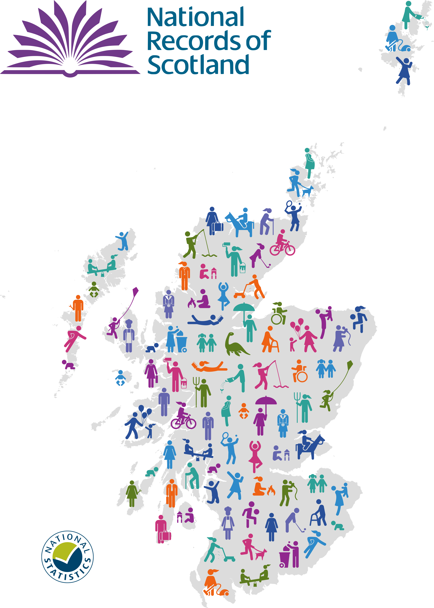

<head>
<!--Global site tag (gtag.js) - Google Analytics -->
<script async src="https://www.googletagmanager.com/gtag/js?id=UA-1263113-7"></script>
<script>
  window.dataLayer = window.dataLayer || [];
  function gtag(){dataLayer.push(arguments);}
  gtag('js', new Date());
  gtag('config', 'UA-1263113-7');
</script>
</head>

<html lang="en">

<!-- <script> -->
<!--    $(document).ready(function() { -->
<!--      $head = $('#header'); -->
<!--      $head.prepend('') -->
<!--    }); -->
<!-- </script> -->

```{r setup, include=FALSE}

knitr::opts_chunk$set(echo = FALSE, out.width = '100%')
library(htmltools)
for (script in list.files("scripts", full.names = TRUE)) {
  source(script)
}

```

**The Registrar General's Annual Review of Demographic Trends**

<div class="row">
  <div class="col-md-6">

```{r}
text_output("summary", "details", subtitle = F)
```
  
  </div>
  
  <div class="col-md-6">
  
  
  
```{r}
text_output("summary", "copyright", subtitle = F)
```  

  </div>
</div>

<br/>

```{r}
text_output("summary", "summary",  subtitle = F)
```

  <center>

  

```{r}
text_output("summary", "name", subtitle = F)
```
  
  </center>


<br/>

## Health inequality

<div class="alert alert-define">

  <div class="row">
  <div class="col-md-12">
  
```{r}
text_output("health_inequality", "quote", subtitle = F)
```
  
  </div>
  </div>
  <div class="row">
  <div class="col-md-12">
  <center>
  
  
  
```{r}
text_output("health_inequality", "name", subtitle = F)
```
  
  </center>
  </div>
  </div>
</div>

```{r}
text_output("health_inequality", "deprivation", subtitle = T)
```

**Ratio of mortality rates between the most and least deprived areas by cause of death, 2001 to 2021** 
Note: A ratio higher than one means the rate in the <b>most</b> deprived areas is <b>higher</b> than the <b>least</b> deprived areas.

```{r echo=FALSE}
plots[["INEQUALITY_SIMD"]]
```

Source: [Age-standardised death rates](https://www.nrscotland.gov.uk/statistics-and-data/statistics/statistics-by-theme/vital-events/deaths/age-standardised-death-rates-calculated-using-the-esp)


<br/>


### Life expectancy
<!-- This subtitle is not in the text spreadsheet as it is referenced with an internal link and won't work from the text_output() function -->


```{r}
text_output("health_inequality", "life_expectancy", subtitle = F)
```


**Life expectancy at birth in Scotland by sex compared to other countries, 1981 to 2020**
```{r echo=FALSE}
plots[["INEQUALITY_life_expectancy"]]
```

Source: [Life Expectancy in Scotland (NRS)](https://www.nrscotland.gov.uk/statistics-and-data/statistics/statistics-by-theme/life-expectancy/life-expectancy-at-scotland-level), [Life expectancy at birth by sex (Eurostat)](https://ec.europa.eu/eurostat/web/products-datasets/product?code=sdg_03_10)


<br/>

```{r}
text_output("health_inequality", "covid", subtitle = T)
```


<br/>

<div class="alert alert-info">

```{r}
text_output("health_inequality", "find_out_more", subtitle = F)
```

</div>

<br/>


## COVID-19 deaths

<div class="alert alert-define">

  <div class="row">
  <div class="col-md-12">
  
```{r}
text_output("covid_19", "quote", subtitle = F)
```
  
  </div>
  </div>
  <div class="row">
  <div class="col-md-12">
  <center>

  

```{r}
text_output("covid_19", "name", subtitle = F)
```
  
  </center>
  </div>
  </div>
</div>


```{r}
text_output("covid_19", "covid_deaths", subtitle = T)
```


**COVID-19 deaths in Scotland by location of death, March 2020 to August 2022**
```{r echo=FALSE}
plots[["COVID_location"]]
```

Source: [Deaths involving COVID-19 in Scotland](https://www.nrscotland.gov.uk/covid19stats)

<br/>

```{r}
text_output("covid_19", "other_deaths", subtitle = T)
```


**Deaths from selected causes in Scotland, 1994 to 2021**

```{r echo=FALSE}
plots[["COVID_other_deaths"]]
```

Source: [Vital events - Deaths](https://www.nrscotland.gov.uk/statistics-and-data/statistics/statistics-by-theme/vital-events/deaths)

<br/>

<div class="alert alert-info">

```{r}
text_output("covid_19", "find_out_more", subtitle = F)
```

</div>

<br/>


## Population

<div class="alert alert-define">

  <div class="row">
  <div class="col-md-12">

```{r}
text_output("population", "quote", subtitle = F)
```

  </div>
  </div>
  <div class="row">
  <div class="col-md-12">
  <center>

  
  
```{r}
text_output("population", "name", subtitle = F)
```

  </center>
  </div>
  </div>
</div>

```{r}
text_output("population", "pop_decline", subtitle = T)
```


**Natural change and net migration in Scotland with projections, 1956 to 2045**
```{r}
plots[["POPULATION_migration"]]
```

Source: [Mid-year population estimates](https://www.nrscotland.gov.uk/statistics-and-data/statistics/statistics-by-theme/population/population-estimates/mid-year-population-estimates/mid-2020), [Population projections](https://www.nrscotland.gov.uk/statistics-and-data/statistics/statistics-by-theme/population/population-projections/population-projections-scotland/2020-based)

<br/>

```{r}
text_output("population", "ageing_pop", subtitle = T)
```


**Projected population change by single year of age, principal projection, 2020 to 2045**
```{r}
plots[["POPULATION_change"]]
```

Source: [Population projections](https://www.nrscotland.gov.uk/statistics-and-data/statistics/statistics-by-theme/population/population-projections/population-projections-scotland/2020-based)

<br/>

```{r}
text_output("population", "local_differences", subtitle = T)
```


**Projected population change, 2018 to 2028**


Source: [Population projections for Scottish areas (2018-based)](https://www.nrscotland.gov.uk/statistics-and-data/statistics/statistics-by-theme/population/population-projections/sub-national-population-projections/2018-based)

<br/>

```{r}
text_output("population", "smaller_households", subtitle = T)
```


<br/>

<div class="alert alert-info">

```{r}
text_output("population", "find_out_more", subtitle = F)
```

</div>


## Marriage and civil partnerships

<div class="alert alert-define">

  <div class="row">
  <div class="col-md-12">
  
```{r}
text_output("marriage", "quote", subtitle = F)
```
  
  </div>
  </div>
  <div class="row">
  <div class="col-md-12">
  <center>
  
  
  
```{r}
text_output("marriage", "name", subtitle = F)

```

  </center>
  </div>
  </div>
</div>


```{r}
text_output("marriage", "unions", subtitle = F)
```

**Civil partnerships and same-sex marriages in Scotland, 2005 to 2021**
```{r}
plots[["MARRIAGE_marriages"]]
```

Source: [Marriages and Civil Partnerships](https://www.nrscotland.gov.uk/statistics-and-data/statistics/statistics-by-theme/vital-events/general-publications/vital-events-reference-tables/2021/list-of-data-tables#section7)


<br/>

<div class="alert alert-info">

```{r}
text_output("marriage", "find_out_more", subtitle = F)
```

</div>

<br/>
