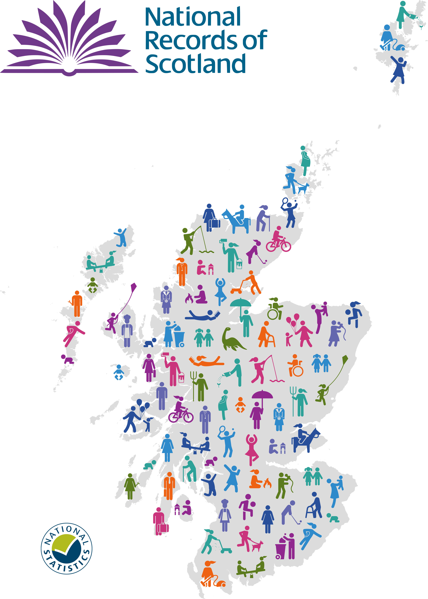

```{r setup, include=FALSE}
knitr::opts_chunk$set(echo = FALSE, out.width = '100%')
library(htmltools)
for (script in list.files("pdf_scripts", full.names = TRUE)) {
  source(script)
}

```

`r text_output("summary", "details", subtitle = F) `


```{r, out.width = "90%"}

```

`r text_output("summary", "copyright", subtitle = F)`

&nbsp;

\pagebreak

## Summary


  
`r text_output("summary", "summary", subtitle = F)`

`r text_output("summary", "name", subtitle = F)`

&nbsp;


## Health inequality

  
```{r, out.width = "50%"}
knitr::include_graphics("images/JR_portrait.png")
```


`r text_output("health_inequality", "quote", subtitle = F)`

`r text_output("health_inequality", "name", subtitle = F)`
  

`r text_output("health_inequality", "deprivation", subtitle = T)`

\pagebreak

**Ratio of mortality rates between the most and least deprived areas by cause of death, 2001 to 2021** 
Note: A ratio higher than one means the rate in the <b>most</b> deprived areas is <b>higher</b> than the <b>least</b> deprived areas.

```{r}
knitr::include_graphics("images/plots/INEQUALITY_simd.png")

```

Source: [Age-standardised death rates](https://www.nrscotland.gov.uk/statistics-and-data/statistics/statistics-by-theme/vital-events/deaths/age-standardised-death-rates-calculated-using-the-esp)

&nbsp;

### Life expectancy
<!-- This subtitle is not in the text spreadsheet as it is referenced with an internal link and won't work from the text_output() function -->

`r text_output("health_inequality", "life_expectancy", subtitle = F)`


**Life expectancy at birth in Scotland by sex compared to other countries, 1981 to 2020**
```{r}
knitr::include_graphics("images/plots/INEQUALITY_life_expectancy.png")

```

Source: [Life Expectancy in Scotland (NRS)](https://www.nrscotland.gov.uk/statistics-and-data/statistics/statistics-by-theme/life-expectancy/life-expectancy-at-scotland-level), [Life expectancy at birth by sex (Eurostat)](https://ec.europa.eu/eurostat/web/products-datasets/product?code=sdg_03_10)


`r text_output("health_inequality", "covid", subtitle = T)`


`r text_output("health_inequality", "find_out_more", subtitle = F)`


\pagebreak

## COVID-19 deaths
   
```{r, out.width = "50%"}
knitr::include_graphics("images/DB_portrait.png")
```


`r text_output("covid_19","quote", subtitle = F)`

`r text_output("covid_19","name", subtitle = F)`


`r text_output("covid_19", "covid_deaths", subtitle = T)`

&nbsp;

**COVID-19 deaths in Scotland by location of death, March 2020 to August 2022**
```{r echo=FALSE}

  knitr::include_graphics("images/plots/COVID_location.png")

```

Source: [Deaths involving COVID-19 in Scotland](https://www.nrscotland.gov.uk/covid19stats)

&nbsp;

`r text_output("covid_19", "other_deaths", subtitle = T)`


**Other deaths by cause of death in Scotland, 2001 to 2021**
```{r echo=FALSE}

  knitr::include_graphics("images/plots/COVID_other_deaths.PNG")

```

Source: [Vital events - Deaths](https://www.nrscotland.gov.uk/statistics-and-data/statistics/statistics-by-theme/vital-events/deaths)


&nbsp;

`r text_output("covid_19", "find_out_more", subtitle = F)`


\pagebreak


## Population

```{r, out.width = "50%"}

knitr::include_graphics("images/ER_portrait.png")
```


`r text_output("population", "quote", subtitle = F)`

`r text_output("population", "name", subtitle = F)`


`r text_output("population", "pop_decline", subtitle = T)`


&nbsp;

\pagebreak

**Natural change and net migration in Scotland with projections, 1956 to 2045**
```{r echo=FALSE}

knitr::include_graphics("images/plots/POPULATION_migration.png")
```

Source: [Mid-year population estimates](https://www.nrscotland.gov.uk/statistics-and-data/statistics/statistics-by-theme/population/population-estimates/mid-year-population-estimates/mid-2020), [Population projections](https://www.nrscotland.gov.uk/statistics-and-data/statistics/statistics-by-theme/population/population-projections/population-projections-scotland/2020-based)


&nbsp;


`r text_output("population", "ageing_pop", subtitle = T)`

&nbsp;

\pagebreak

**Projected population change by single year of age, principal projection, 2020 to 2045**
```{r echo=FALSE}

  knitr::include_graphics("images/plots/POPULATION_change.png")
  
```

Source: [Population projections](https://www.nrscotland.gov.uk/statistics-and-data/statistics/statistics-by-theme/population/population-projections/population-projections-scotland/2020-based)


`r text_output("population", "local_differences", subtitle = T)`


\pagebreak

**Projected population change, 2018 to 2028**
```{r echo=FALSE}

 knitr::include_graphics("images/plots/map.svg")

```

Source: [Population projections for Scottish areas (2018-based)](https://www.nrscotland.gov.uk/statistics-and-data/statistics/statistics-by-theme/population/population-projections/sub-national-population-projections/2018-based)

&nbsp;


`r text_output("population", "smaller_households", subtitle = T)`


`r text_output("population", "find_out_more", subtitle = F)`

&nbsp;


\pagebreak

## Marriage and civil partnerships

  
```{r, out.width = "50%"}
knitr::include_graphics("images/RB_portrait.png")
```

`r text_output("marriage", "quote", subtitle = F)`

`r text_output("marriage", "name", subtitle = F)`


&nbsp;

`r text_output("marriage", "unions", subtitle = F)`


**Civil partnerships and same-sex marriages in Scotland, 2005 to 2021**
```{r}
knitr::include_graphics("images/plots/MARRIAGE_unions.png")

```

Source: [Marriages and Civil Partnerships](https://www.nrscotland.gov.uk/statistics-and-data/statistics/statistics-by-theme/vital-events/general-publications/vital-events-reference-tables/2021/list-of-data-tables#section7)


&nbsp;


`r text_output("marriage", "find_out_more", subtitle = F)`

